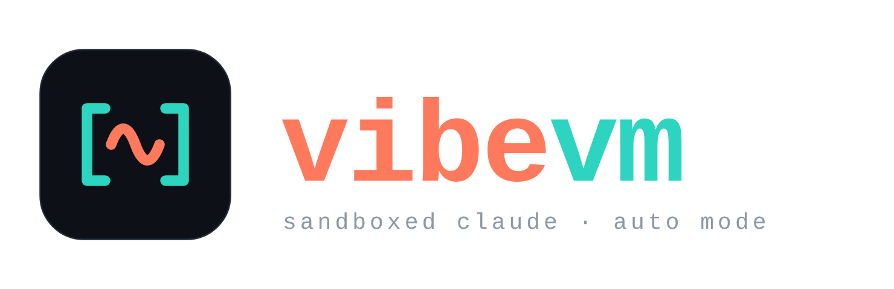

<p align="center">
  
</p>

<p align="center">
  A throwaway KVM virtual machine where you can run Claude Code in auto mode
  without putting your host, your credentials, or the network at risk.
</p>

---

**vibevm** is an [incus](https://linuxcontainers.org/incus/) KVM virtual machine
(Ubuntu 26.04 LTS) tuned for running `claude --dangerously-skip-permissions`
(auto / "YOLO" mode). You edit projects on the host with your normal tools; Claude
works on the same files inside the VM, where a destructive command, a leaked
secret, or a prompt-injection payload can't reach beyond a disposable guest.

## Why a VM

Auto mode removes the approval prompt on every command and file write. vibevm
contains the fallout with three layers:

| Layer | How |
| --- | --- |
| **Blast radius** | A full KVM VM (separate kernel), disposable. Trash it and restore the `clean` snapshot. |
| **Egress allowlist** | An in-VM domain-allowlisting proxy (`tinyproxy`); `nftables` forces all web egress through it (default-drop otherwise). |
| **Least privilege** | Claude runs as the unprivileged `vibe` user with **no sudo**. IPv6 is off so the v4 allowlist is total. Only a *scoped* API key is injected, at launch. |

The VM is the boundary that matters — treat the guest as untrusted and keep real
host credentials out of it. The full threat model and the mechanics of each layer
are in **[DESIGN.md](DESIGN.md)**.

## Quick start

Requires a Linux host with incus and KVM virtualization.

```sh
./bootstrap.sh          # one time; sudo. Then start a NEW shell / restart Claude Code.
cp secrets.env.example secrets.env && $EDITOR secrets.env   # optional: scoped API key
cp vibevm.conf.example vibevm.conf  && $EDITOR vibevm.conf   # optional: tune VM/versions/mirrors
./create-vm.sh          # build + provision the VM (a few minutes)
./vibe                  # vibe-code in auto mode
```

The two `cp` steps are optional — vibevm runs unmodified with sensible defaults.
Put the projects you want to work on under `~/workspace` (see below).

## Everyday use

```sh
./vibe [PROJECT]        # Claude in auto mode, in ~/workspace[/PROJECT]
./vibe shell [PROJECT]  # login shell in the VM
./vibe mounts           # (re)mount project dirs after editing workspaces.conf
./vibe persist          # back ~/.claude with host ./claude-home (survives rebuilds)
./vibe statusline       # re-sync your host Claude status line into the VM
./vibe firewall status  # show egress mode; `off` opens egress, `on` re-enforces

incus snapshot restore vibevm clean   # roll back a messed-up VM
incus stop vibevm                     # pause
./create-vm.sh --rebuild              # delete + recreate (host-backed state preserved)
```

`./vibe` starts Claude in `~/workspace` (it sees every mounted project), or
`./vibe <name>` to start directly inside `~/workspace/<name>`. Arguments after the
project pass through to Claude — e.g. `./vibe . --resume`.

**Persistence:** a rebuild wipes the VM disk, but `./vibe persist` backs
`~/.claude` (history, sessions, memory, login) with a host folder so it survives.
`./create-vm.sh --rebuild` captures it for you before deleting. Details in
[DESIGN.md](DESIGN.md#persistence-across-rebuilds).

## Projects & git

**Mounting (`~/workspace`).** Host directories are shared into the VM live via
virtiofs, each at `/home/vibe/workspace/<name>`. Two ways, combinable:

- **Drop-in:** put or `git clone` projects into `./workspace/<name>/` — every
  subdirectory is mounted automatically.
- **External paths:** list host dirs in `./workspaces.conf` (copy the `.example`);
  `/abs/path` or `name=/abs/path`, one per line.

Apply changes any time with `./vibe mounts`.

**Git pushes happen from the host**, not the VM — the VM deliberately holds no git
credentials and SSH is blocked. The agent commits inside the VM (attributed to
your host git identity, carried in at launch); because the repo is virtiofs-shared
those commits are immediately on the host, where you `git push` with your normal
credentials.

## Configuration

Host settings live in `vibevm.conf` (copy from `vibevm.conf.example`, gitignored).
Anything unset falls back to the default in `config.sh`:

| Setting | Default | Controls |
| --- | --- | --- |
| `VM_NAME` / `VM_IMAGE` | `vibevm` / `images:ubuntu/26.04` | incus instance name and base image. |
| `VM_CPU` / `VM_MEM` / `VM_DISK` | `8` / `16GiB` / `40GiB` | VM resource limits. |
| `NODE_DEFAULT` / `NVM_VERSION` | `24.16.0` / `v0.40.1` | nvm's default Node and the nvm release. |
| `JAVA_VERSION` / `JAVA_EXTRA_MAJORS` / `MAVEN_VERSION` / `GRADLE_VERSION` | SDKMAN latest / `21` / latest / latest | SDKMAN tool versions. |
| `APT_PACKAGES` | `git-filter-repo ripgrep python3… vim btop` | Dev apt packages (an essential core is always installed too). |
| `NEXUS_MAVEN_URL` / `REGISTRY_MIRROR` | *(empty)* | Optional Maven/Gradle + Docker mirrors; empty = public sources. |

Resource limits apply on `./create-vm.sh --rebuild`; provisioning knobs (versions,
packages, mirrors) apply on a plain `./create-vm.sh` (re-provisions, no rebuild).

**Egress allowlist.** The domains the VM may reach live in `./allowlist` (copy
from `allowlist.example`; one host regex per line). Edit it and re-apply:

```sh
$EDITOR allowlist
incus file push allowlist vibevm/root/allowlist --mode 0644
incus exec vibevm -- bash /usr/local/bin/harden.sh   # reinstall list + restart tinyproxy
```

Denied requests show as `403 Filtered` / `CONNECT tunnel failed`. (Replace
`vibevm` with your `VM_NAME` if changed.)

**Toggling the firewall.** `./vibe firewall off` opens egress (handy when you
knowingly need broad access); `on` re-enforces. The choice persists across
reboots, and only the host operator can flip it — the `vibe` agent can't.

**Custom API endpoint.** To point Claude at a gateway instead of
`api.anthropic.com`, set `ANTHROPIC_BASE_URL` (and an auth token) in `secrets.env`;
`./vibe` forwards it and auto-allows that host for direct egress — no firewall
edits needed.

## Preinstalled tooling

Beyond the base tooling (git, ripgrep, build-essential, Python 3), `devtools.sh`
installs:

| Runtime | How | Notes |
| --- | --- | --- |
| **Node** | `nvm` (per-user) | default Node 24 (`NODE_DEFAULT`); `nvm install/use <ver>` to switch. |
| **Java** | `SDKMAN` (per-user) | latest Temurin + JDK 21; `JAVA_EXTRA_MAJORS` adds more. |
| **Maven + Gradle** | `SDKMAN` (per-user) | resolve from public Maven Central + Gradle Plugin Portal out of the box; optional Nexus mirror via `NEXUS_MAVEN_URL`. |
| **Chrome + Lighthouse** | system Chrome + `lighthouse` | `CHROME_PATH` preset; works headless for the `vibe` user. |
| **Docker** | rootful (`docker` + compose + buildx) | works directly in a session; image pulls go through the allowlist. |

Java builds and rootful Docker both have important details and trade-offs —
see [DESIGN.md](DESIGN.md#developer-runtimes--the-jvm-proxy).

## Trade-offs to know

- **HTTP/HTTPS only** through the proxy (80/443) — use `https://` git remotes, not
  SSH.
- **Rootful Docker weakens egress control**: the `docker` group is
  root-equivalent in the VM and container traffic bypasses the allowlist. The VM
  (not the allowlist) is the boundary against Docker misuse.
- **No sudo for `vibe`** by design — install OS packages via `APT_PACKAGES` in
  `vibevm.conf`, not from inside a session.
- **Don't reuse credentials**: use a scoped, low-privilege `ANTHROPIC_API_KEY`,
  and don't mount host SSH keys or cloud creds into `~/workspace`.

## How it works

The build, the network policy, the persistence mechanics, the threat model, and
the design rationale behind each trade-off are documented in
**[DESIGN.md](DESIGN.md)**.
